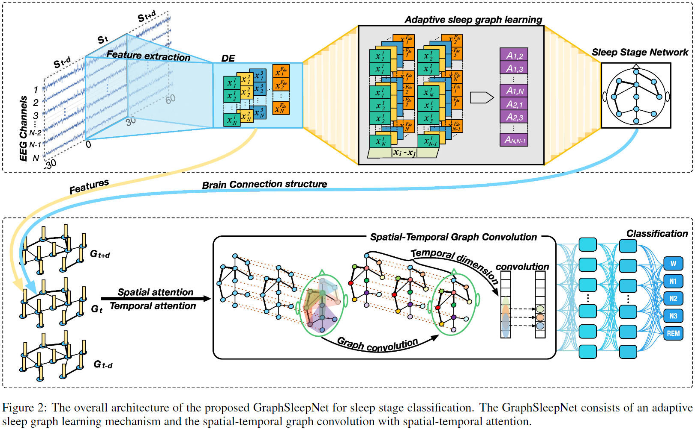
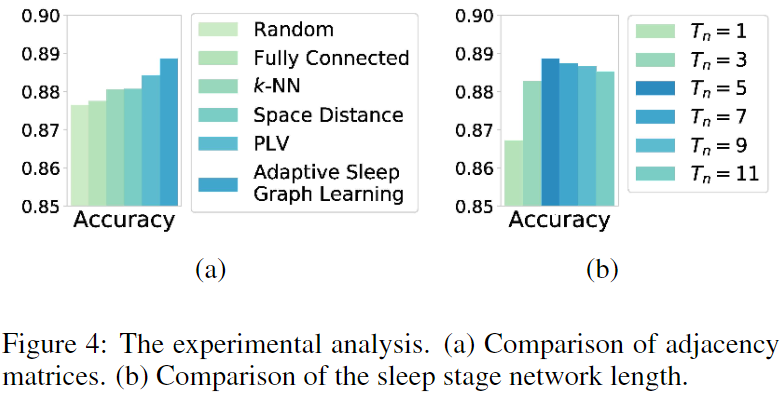

若公式无法正常显示，推荐使用 [GitHub with MathJax](https://chrome.google.com/webstore/detail/github-with-mathjax/ioemnmodlmafdkllaclgeombjnmnbima) 插件，或直接阅读 [HTML版](https://ziyujia.github.io/CRM/Materials/GraphSleepNet/GraphSleepNet.html) / [PDF版](GraphSleepNet.pdf)

---

## **[IJCAI 2020] 面向睡眠阶段分类的自适应时空图卷积神经网络**

本文介绍一篇北京交通大学网络科学与智能系统研究所贾子钰博士等人，于 IJCAI 2020 发表的论文《GraphSleepNet: Adaptive Spatial-Temporal Graph Convolutional Networks for Sleep Stage Classification》，该研究提出一种多变量时间序列分类的通用图神经网络框架并首次应用于睡眠阶段分类。

**论文标题：**

GraphSleepNet: Adaptive Spatial-Temporal Graph Convolutional Networks for Sleep Stage Classification

**论文链接：**

https://www.ijcai.org/Proceedings/2020/0184.pdf

**论文代码链接：**

https://github.com/ziyujia/GraphSleepNet

**论文作者主页：**

https://ziyujia.github.io/

## **01. 背景简介**

睡眠阶段分类对睡眠质量的评估和疾病的诊断具有重要意义，睡眠专家通常根据睡眠分期标准和多导睡眠图（polysomnography, PSG）来判定睡眠状态。在目前的睡眠分期领域研究中，睡眠专家通常使用R&K睡眠分期标准和美国睡眠医学会（AASM）制定的睡眠分期标准进行睡眠阶段的识别。特别是在AASM标准中还记录了不同睡眠阶段之间的转换规则，帮助睡眠专家通过时间上下文进行睡眠分期。虽然有标准和规则提供决策支持，但是由睡眠专家人工进行睡眠分期仍然是一项繁琐且耗时的任务，分期结果也容易受到睡眠专家主观意识的影响。

## **02. 动机**

### **2.1 挑战**

**2.1.1 网格数据的局限性。**

目前大多数睡眠分期模型大多使用CNNs和RNNs模型，尽管CNNs和RNNs能够实现较高的睡眠分期准确率，但它们的局限性在于模型的输入必须是网格数据（例如2D图像表示），这导致了大脑区域之间的联系被忽略。由于大脑区域处于非欧式空间，因此图应当是表示大脑连接性最自然且最适合的数据结构。

**2.1.2 图卷积与对大脑的功能性连接进行建模。**

基于图卷积神经网络在图结构数据中的成功应用，我们采用图结构表示方法研究睡眠分期问题，在多导EEG数据中，每个EEG通道对应于睡眠图中的一个节点，两个节点之间的连接对应于睡眠图中存在的边。固定的图结构是图卷积神经网络中的重要输入，也是提取空间信息的关键。但由于人类对人脑的认知是有限的，因此为睡眠分期预定义合适的空间脑连接结构仍然是一个挑战。因此，论文尝试提出一种数据驱动的大脑连接结构学习模块与与时空图卷积集成于统一的图神经网络框架。

**2.1.3 睡眠过渡规则。**

如何利用相邻睡眠阶段之间的过渡规则也是一个挑战。睡眠专家在进行当前睡眠阶段的分期时，往往会结合其相邻睡眠阶段。因此，充分利用睡眠阶段间的过渡规则往往能够提升睡眠分期的准确率。

### **2.2 贡献**

1. 据我们所知，这是首次尝试将ST-GCN应用于睡眠分期领域。此外，我们提出了一种新的自适应睡眠图学习机制，它与ST-GCN同时被集成在统一的深度神经网络的架构中。
2. 我们设计了一种基于注意力机制的时空卷积结构，它可以有效的捕获不同睡眠阶段的空间特征和睡眠阶段之间的转换规则。
3. 在基准数据集的实验结果表明，提出的GraphSleepNet优于传统的基线方法，取得了SOTA的性能。

## **03. 问题定义**

在本研究中睡眠阶段网络被定义为无向图$G=(V, E, \boldsymbol{A})$，其中V表示节点集合，每个节点都对应一个通道(电极)，|V|=N表示睡眠阶段网络中节点的个数；E是边的集合，表示节点之间的连接关系；$\boldsymbol{A}$表示睡眠阶段网络G的邻接矩阵。如图1所示，$G_t$是由一个30s的脑电信号序列$S_t$构建的，且本文所提出的模型中使用的邻接矩阵$\boldsymbol{A}$是通过学习得到的，而不是传统的GCNs通常使用的固定的邻接矩阵。

睡眠特征矩阵是图形睡眠网的输入。我们将原始信号序列定义为$\boldsymbol{S}=\left(\boldsymbol{s}_{1}, \boldsymbol{s}_{2}, \ldots, \boldsymbol{s}_{L}\right) \in \mathbb{R}^{L \times N \times T_{s}}$，其中L表示样本数，Ts表示每个样本的时间序列长度$\boldsymbol{s}_{i} \in \boldsymbol{S}(i \in\{1,2, \cdots, L\})$。对于每个样本$\boldsymbol{s}_i$，我们提取不同频带上的差分熵(DE)特征，并定义每个样本$\boldsymbol{s}_i$的特征矩阵$\boldsymbol{X}_{i}=\left(\boldsymbol{x}_{1}^{i}, \boldsymbol{x}_{2}^{i}, \ldots, \boldsymbol{x}_{N}^{i}\right)^{T} \in \mathbb{R}^{N \times F_{d e}}$，其中$\boldsymbol{x}_{n}^{i} \in \mathbb{R}^{F_{d e}}(n \in\{1,2, \cdots, N\})$表示样本i的第n个节点的$F_{de}$个特征。

本文通过时空图卷积神经网络对脑电信号编码并建立其与睡眠分期之间的映射关系。睡眠分期问题定义为：给定睡眠阶段网络序列$\boldsymbol{\mathcal{X}}=\left(\boldsymbol{X}_{i-d}, \ldots, \boldsymbol{X}_{i}, \ldots, \boldsymbol{X}_{i+d}\right) \in \mathbb{R}^{N \times F_{d e} \times T_{n}}$，对当前阶段的睡眠分期y进行分类识别。其中$\boldsymbol{\mathcal{X}}$表示$\boldsymbol{X}_{i}$在时间维度的上下文，y表示$\boldsymbol{X}_{i}$的睡眠阶段类别标签，Tn=2d+1表示睡眠阶段网络的长度，其中d∈N+表示时间上下文系数。

## **04. Adaptive Spatial-Temporal GCN**

GraphSleepNet的总体架构如图2所示。我们总结了本文模型的三大关键点：

1）该模型能够表示节点之间的功能连接关系并动态构造邻接矩阵（脑连接网络）。

2）该模型利用空间图卷积和时间卷积提取睡眠脑电信号的空间特征和时间特征。

3）该模型采用时空注意机制自动捕获更有价值的时空信息进行高精度分类。

### **4.1 Adaptive Sleep Graph Learning**

如图3所示，自适应睡眠图学习可以动态地学习图结构，而不是通过先验知识或人为地构造图（如k近邻图）。因此，基于输入的矩阵$\boldsymbol{X}_{i}=\left(\boldsymbol{x}_{1}^{i}, \boldsymbol{x}_{2}^{i}, \ldots, \boldsymbol{x}_{N}^{i}\right)^{T} \in \mathbb{R}^{N \times F_{d e}}$，我们定义了一个非负函数$A_{m n}=g\left(\boldsymbol{x}_{m}, \boldsymbol{x}_{n}\right)(m, n \in\{1,2,\cdots,N\})$来表示节点$\boldsymbol{x}_{m}$和$\boldsymbol{x}_{n}$之间的连接关系。$g\left(\boldsymbol{x}_{m}, \boldsymbol{x}_{n}\right)$通过具有可学习权向量$\boldsymbol{w}=\left(w_{1}, w_{2}, \ldots, w_{F_{d e}}\right)^{T} \in \mathbb{R}^{F_{d e} \times 1}$的神经网络来实现，学习的图结构（邻接矩阵）$\boldsymbol{A}$定义为：

$$
A_{m n}=g\left(\boldsymbol{x}_{m}, \boldsymbol{x}_{n}\right)=\frac{\exp \left(\operatorname{ReLU}\left(\boldsymbol{w}^{T}\left|\boldsymbol{x}_{m}-\boldsymbol{x}_{n}\right|\right)\right)}{\sum_{n=1}^{N} \exp \left(\operatorname{ReLU}\left(\boldsymbol{w}^{T}\left|\boldsymbol{x}_{m}-\boldsymbol{x}_{n}\right|\right)\right)}
$$

其中，激活函数ReLU保证了$A_{m n}$是非负的。softmax对$\boldsymbol{A}$的每一行进行规范化。权向量$\boldsymbol{w}$通过最小化以下损失函数来更新：
$$
\mathcal{L}_{\text {graph_learning}}=\sum_{m, n=1}^{N}\left\|\boldsymbol{x}_{m}-\boldsymbol{x}_{n}\right\|_{2}^{2} A_{m n}+\lambda\|\boldsymbol{A}\|_{F}^{2}
$$
这样，节点m与节点n之间的距离越大，$A_{m n}$越小。由于大脑连接结构不是一个完全连通的图，我们利用上述损失函数的第二项来控制图的稀疏性，其中λ ≥ 0为正则化参数。为了避免损失函数最小化而产生平凡解（即$\boldsymbol{w}=\{0,0,\cdots,0\}$），我们将它作为正则项来形成最终的损失函数。
$$
\mathcal{L}_{\text {loss}}=\mathcal{L}_{\text {cross_entropy}}+\mathcal{L}_{\text {graph_learning}}
$$

$$
\mathcal{L}_{\text {cross_entropy }}=-\frac{1}{L} \sum_{i=1}^{L} \sum_{r=1}^{R} y_{i, r} \log \hat{y}_{i, r}
$$

其中，$\mathcal{L}_{\text {cross_entropy }}$为多分类任务的原始损失函数，L为样本数，R为类别数。

### **4.2 Spatial-Temporal Graph Convolution**

时空图卷积结合了空间图卷积和时间卷积，用于提取时空特征。如图2所示，空间图卷积通过聚合每个睡眠阶段网络中的邻接节点的信息来捕获空间特征。时间卷积提取相邻睡眠阶段间的时间依赖来捕捉睡眠转化规则，进而提升模型分类效果。

#### **（1）Spatial Graph Convolution**

我们利用基于谱图理论的图卷积来提取空间维度上的空间特征。对于每个待识别的睡眠阶段，自适应睡眠图学习模块会提供一个邻接矩阵$\boldsymbol{A}$。我们利用图拉普拉斯算子的切比雪夫展开来降低计算复杂度。基于K-1阶切比雪夫多项式的切比雪夫图卷积定义为：
$$
g_{\theta} *_{G} x=g_{\theta}(\mathbf{L}) x=\sum_{k=0}^{K-1} \theta_{k} T_{k}(\tilde{\mathbf{L}}) x
$$
其中$g_{\theta}$为卷积核，$*_{G}$表示图卷积运算，$\theta \in \mathbb{R}^{K}$表示切比雪夫系数的向量，$x$表示输入的数据，$\boldsymbol{L}=\boldsymbol{D}-\boldsymbol{A}$表示拉普拉斯矩阵，$\boldsymbol{D} \in \mathbb{R}^{N \times N}$表示度数矩阵，$\tilde{\boldsymbol{L}}=\frac{2}{\lambda_{\max }} \boldsymbol{L}-\boldsymbol{I}_{N}$，$\lambda_{\max }$是拉普拉斯矩阵的最大特征值，$\boldsymbol{I}_{N}$是单位矩阵。$T_{k}(x)=2xT_{k-1}(x)+T_{k-2}(x)$是递归定义的切比雪夫多项式，特别地，$T_{0}(x)=1$，$T_{1}(x)=x$。

通过使用切比雪夫多项式的近似展开，可以提取到以每个节点为中心的 0 到 K -1 阶邻居的信息。

在本次工作中，我们将上述定义推广到具有多个特征的节点。第l层的输入表示为$\hat{\mathcal{X}}^{(l-1)}=\left(\hat{\boldsymbol{X}}_{1}, \hat{\boldsymbol{X}}_{2}, \ldots, \hat{\boldsymbol{X}}_{T_{l-1}}\right) \in \mathbb{R}^{N \times C_{l-1} \times T_{l-1}}$，$C_{l−1}$为每个节点的通道数，当l=1时，$C_0=F_{de}$。$T_{l−1}$表示第l层的时间维度。对于每个$\hat{\boldsymbol{X}}_{i}$，我们使用$C_l$个卷积核进行图卷积操作$g_{\theta} *_{G} \hat{\boldsymbol{X}_i}$，其中卷积核的参数为$\Theta=\left(\Theta_{1}, \Theta_{2}, \ldots, \Theta_{C_{l}}\right) \in \mathbb{R}^{K \times C_{l-1} \times C_{l}}$，因此，每个节点都能聚合其0~K-1阶邻居节点的信息。

#### **（2）Temporal Convolution**

为了捕捉睡眠转换规则，睡眠专家通常结合相邻的睡眠阶段对当前睡眠阶段进行分类，我们则使用CNN在时间维度上进行卷积运算。具体来说，在图卷积运算充分提取每个睡眠阶段网络的空间特征后，我们使用一个标准的2D卷积层来提取当前睡眠阶段的时间上下文信息。第l层的时域卷积运算定义为：
$$
\mathcal{X}^{(l)}=\operatorname{ReLU}\left(\Phi *\left(\operatorname{ReLU}\left(g_{\theta} *_{G} \hat{\mathcal{X}}^{(l-1)}\right)\right)\right) \in \mathbb{R}^{N \times C_{l} \times T_{l}}
$$
其中ReLU是激活函数，Φ表示卷积内核的参数，*表示标准卷积操作。

### **4.3 Spatial-Temporal Attention**

我们使用了一种时空注意力机制来捕获睡眠阶段网络上有价值的时空信息。时空注意力机制包括空间注意力和时间注意力。

#### **（1）Spatial Attention**

在空间维度上，不同区域对睡眠阶段的影响是不同的，睡眠阶段是动态变化的。为了自动提取注意空间动态，我们使用了空间注意力机制，其定义如下：
$$
\boldsymbol{P}=\boldsymbol{V}_{p} \cdot \sigma\left(\left(\boldsymbol{\mathcal { X }}^{(l-1)} \boldsymbol{Z}_{1}\right) \boldsymbol{Z}_{2}\left(\boldsymbol{Z}_{3} \boldsymbol{\mathcal { X }}^{(l-1)}\right)^{T}+\boldsymbol{b}_{p}\right)
$$

$$
P_{m, n}^{\prime}=\operatorname{softmax}\left(P_{m, n}\right)
$$

其中，$\boldsymbol{V}_{p}, \boldsymbol{b}_{p} \in \mathbb{R}^{N \times N}$，$\boldsymbol{Z}_{1} \in \mathbb{R}^{T_{l-1}}$，$\boldsymbol{Z}_{2}\in\mathbb{R}^{C_{l-1} \times T_{l-1}}$，$\boldsymbol{Z}_{3} \in \mathbb{R}^{C_{l-1}}$是模型的可训练参数，σ表示sigmoid激活函数。$\mathcal{X}^{(l-1)}=\left(\boldsymbol{X}_{1}, \boldsymbol{X}_{2}, \ldots, \boldsymbol{X}_{T_{l-1}}\right) \in \mathbb{R}^{N \times C_{l-1} \times T_{l-1}}$表示第l层的输入，$\boldsymbol{P}$表示时间注意力矩阵，它是由当前层的输入动态进行计算得到的$P_{m,n}$表示节点m和节点n之间的相关性。最后，使用softmax函数对注意力矩阵进行归一化。模型在进行图卷积时会结合学习的邻接矩阵$\boldsymbol{A}$和空间注意力矩阵$\boldsymbol{P}$，进而实现节点权值的动态更新。

#### **（2）Temporal Attention**

在时间维度上，相邻的睡眠阶段之间通常存在相关性，并且这种相关性在睡眠状态变化时也会发生变化。因此，我们利用时间注意力机制来捕获睡眠阶段网络间的动态时间信息：
$$
\boldsymbol{Q}=\boldsymbol{V}_{q} \cdot \sigma\left(\left(\left(\boldsymbol{\mathcal { X }}^{(l-1)}\right)^{T} \boldsymbol{M}_{1}\right) \boldsymbol{M}_{2}\left(\boldsymbol{M}_{3} \boldsymbol{\mathcal { X }}^{(l-1)}\right)+\boldsymbol{b}_{q}\right)
$$

$$
Q_{m, n}^{\prime}=\operatorname{softmax}\left(Q_{m, n}\right)
$$

其中，$\boldsymbol{V}_{q}, \boldsymbol{b}_{q} \in \mathbb{R}^{T_{l-1} \times T_{l-1}}$，$\boldsymbol{M}_{1} \in \mathbb{R}^{N}$，$\boldsymbol{M}_{2}\in\mathbb{R}^{C_{l-1} \times N}$，$\boldsymbol{M}_{3} \in \mathbb{R}^{C_{l-1}}$是可训练参数。$\boldsymbol{Q}$表示时间注意力矩阵，$Q_{m,n}$表示睡眠阶段m与n之间的相关性。最后，使用softmax函数对注意力矩阵进行归一化。

## **05. 实验**

### **5.1 Datasets**

我们在Montreal Archive of Sleep Studies(MASS)-SS3数据集上评估了我们提出的模型。MASS-SS3数据集包含来自62名健康受试者(28名男性和34名女性)的PSG记录。每次记录包含20导EEG、2导EOG、3导EMG和1导ECG。PSG记录采用0.30-100Hz (EEG)，0.10-100Hz (EOG, ECG)，10-100Hz (EMG)带通滤波器进行预处理。我们从9个交叉频带中提取每个通道的DE特征：0.5-4Hz、2-6Hz、4-8Hz、6-11Hz、8-14Hz、11-22Hz、14-31Hz、22-40Hz、31-50Hz。

### **5.2 Result**

我们与8种Baseline方法进行了比较，结果如表2所示，更多的实验设置、Baseline介绍等请参阅我们的论文原文。

传统的机器学习方法（SVM、RF）不能很好地学习复杂的时空特征。然而现有的深度学习模型如CNN和RNN可以直接提取空间或时间特征，因此其性能优于基于传统机器学习的方法。

虽然CNN和RNN的精度很高，但是这些模型的输入必须是网格数据，忽略了大脑区域之间的连接。由于大脑区域处于非欧几里得空间，图是表示这种联系最合适的数据结构。GraphSleepNet基于自适应睡眠图结构提取时间和空间特征。因此，本文提出的GraphSleepNet方法优于其他基线方法。

### **5.3 Experimental Analysis**

为了进一步研究自适应睡眠图学习的有效性，我们设计了五个固定的邻接矩阵与之进行比较。

图4(a)表明，自适应的邻接矩阵在睡眠分期中获得了最高的准确率。此外，与先验知识相结合的邻接矩阵（如PLV邻接矩阵）取得了次优效果。由于大脑网络不是一个完全连通的图，所以全连通邻接矩阵效果不好。一般情况下，邻接矩阵对分类效果有显著影响。本文提出的用于分类任务的自适应睡眠图学习优于所有固定图。

此外，我们研究了输入睡眠阶段网络的数量（时间上下文的长度）对分类性能的影响。图4(b)显示，随着$T_n$的增加，分类性能有所提高，$T_n=5$时分类准确率最高。值得注意的是，根据AASM标准，睡眠专家也是根据5个睡眠阶段来判断当前的睡眠状态，显示了所提模型的实用性。另外，输入睡眠阶段网络的数量过大会导致分类性能下降，这可能是由于信息冗余造成的。

## **06. 结论**

本文提出了一种新的深度图神经网络用于自动睡眠分期。该模型的主要优点是自适应地学习最适合ST-GCN的睡眠连接结构，以及该模型结合时空卷积和时空注意机制，同时捕获睡眠数据的注意时空特征。该方法为实现睡眠自动分期提供了一种新的思路。此外，该文提出的模型是一个多变量时间序列的通用框架，未来可以应用于时间序列分类、预测等相关领域中。