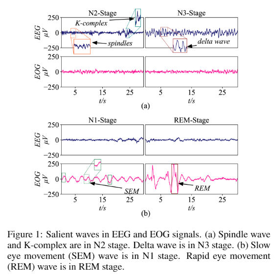
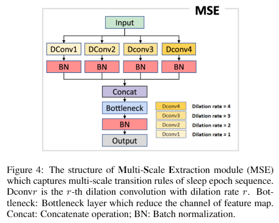
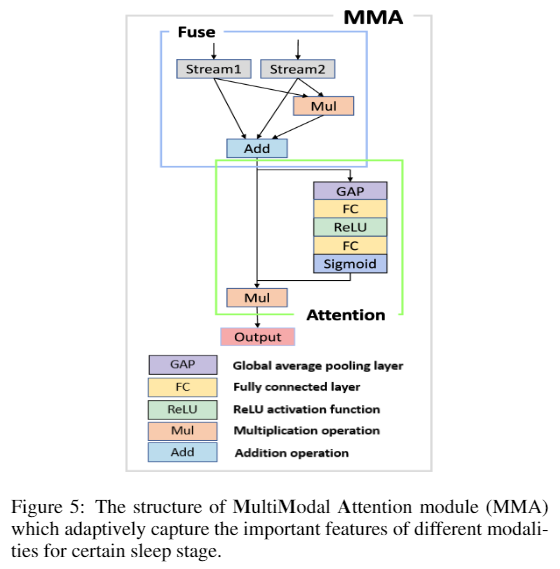
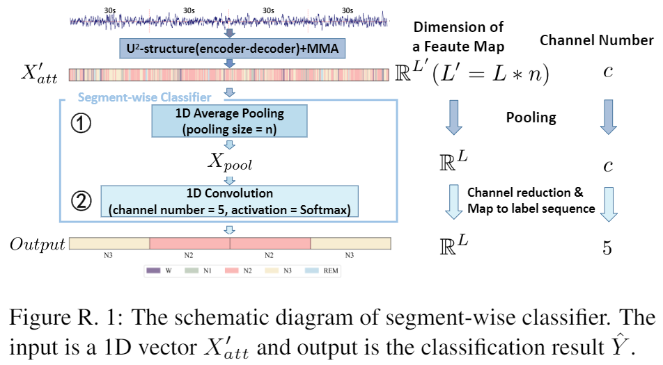
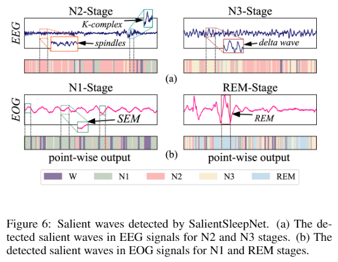

若公式无法正常显示，推荐使用 [GitHub with MathJax](https://chrome.google.com/webstore/detail/github-with-mathjax/ioemnmodlmafdkllaclgeombjnmnbima) 插件，或直接阅读 [HTML版](https://ziyujia.github.io/Chinese-Reading-Materials/Materials/SalientSleepNet/SalientSleepNet.html) / [PDF版](SalientSleepNet.pdf)

---

## **[IJCAI 2021] 面向睡眠阶段分类的多模态显著性波形检测网络**

睡眠阶段分类对于睡眠质量评估和疾病诊断至关重要，睡眠专家通常利用视觉检查的方式对原始睡眠信号进行特征波形的标注和人工分类，但人工标注费时费力且容易受到主观意识的影响。因此，大多数深度学习的方法为了自动化进行睡眠阶段分类，通常提取时频特征间接捕获显著性的特征波形进行分类。该论文提出了一种多模态显著性波形检测模型，将时间序列分类问题转化为显著性检测问题并应用于睡眠阶段分类。提出模型不依赖于时频特征提取，可以直接从原始信号中探测显著波形服务于高精度的睡眠时间序列分类。此外，该模型融合了多模态睡眠数据且捕获了多尺度的睡眠规则，与现有的SOTA模型相比较，提出模型实现简单，参数量小且可解释性强。在多个睡眠数据集的实验表明SalientSleepNet优于该领域的其他模型。

**论文链接：**

https://arxiv.org/abs/2105.13864

**论文代码链接：**

https://github.com/ziyujia/SalientSleepNet

## **01. 背景简介**

睡眠分期对于评估睡眠质量和诊断睡眠障碍有重要意义。为了确定睡眠阶段，睡眠专家通常使用附着在人体不同部位的传感器来记录电活动，以此进行睡眠分期。这些传感器记录的信号称为多导睡眠图（PSG），由脑电图（EEG），眼电图（EOG）和其他生理信号组成。这些记录的信号被分为30秒一个的睡眠期，睡眠专家根据美国睡眠医学学会（AASM）睡眠标准将其分为五个不同的睡眠阶段（W，N1，N2，N3和REM）。然而，人工分期方法是十分费时费力的。所以许多研究人员尝试开发自动睡眠分期方法。

## **02. 动机**

### **2.1 挑战**

#### 2.1.1 显著性波形的捕获

现有大多数模型无法直接捕获原始信号中的显著性波形。根据AASM睡眠标准，不同的睡眠阶段的生理信号通常有不同的显著性波形。例如，图1展示了N2期的显著性波形：睡眠纺锤波和K复合波，而N3期的显著性波形是δ波。现有工作大多通过间接的提取特征来捕获显著性波形。例如，信号的时频特征可以在一定程度上反映显著性波形特征。原始生理信号被转换为时频图像，作为睡眠分期深度学习模型的输入。虽然上述方法间接地捕获了信号的特征，但手动提取的特征不仅需要先验知识，而且还可能导致部分信息丢失。

#### 2.1.2 多尺度睡眠过渡规则提取

多尺度的睡眠过渡规则未被很好的利用。在睡眠过程中，人的大脑在不同的睡眠阶段之间经历着一系列的变化。这些变化的模式被概括为睡眠标准中的过渡规则。睡眠专家通常根据这些规则，结合其邻近的睡眠阶段来确定当前的睡眠阶段。图2展示了AASM睡眠标准中的睡眠过渡规则具有的多尺度特性。为了捕获睡眠过渡规则，一些包含RNN的混合模型经常被使用。然而大多数现有的工作忽略了对睡眠过渡规则的多尺度特征的显式捕捉。此外现有模型表明RNN模块可以被前馈系统（如CNN的变体）取代，并且不会牺牲准确率。

#### 2.1.3 多种模态对不同睡眠阶段的贡献

不同的模态对区分睡眠阶段有不同的贡献。图1表明REM和N1阶段的脑电波相似。然而，两个阶段的EOG波有很大的不同。因此，EOG信号对REM和N1期的分类贡献大于EEG信号。相反，N2和N3阶段的分类主要是根据EEG信号中的显著性波形。因此，在识别不同的睡眠阶段时，所需的模态是不同的。为了利用这些多模态信号，研究人员通常关注多模态的互补性，并通过连接操作来合并多模态特征。这忽略了每一种睡眠模态对确定特定睡眠阶段的作用是不同的。

### **2.2 贡献**
1. 设计了由多个嵌套U形单元组成的$\rm U^2$结构流，以检测生理信号中的显著性波形，这受启发于CV中流行的显著性检测模型$\rm U^2$-Net。
2. 提出了一个多尺度的睡眠过渡规则提取模块，它是由多个不同感受野的空洞卷积组成的，用于捕获多尺度规则。
3. 设计了一个多模态注意力模块，用于自适应地从不同模态数据中获取有价值的信息。
4. 实验结果表明，SalientSleepNet达到了领域内最先进的性能。此外，与现有睡眠分期方面的深度神经网络相比，提出模型拥有最小的参数量。

## **03. 问题定义**

本文提出的模型接收一个序列的睡眠阶段，并输出一个预测的标签序列。每个睡眠阶段被定义为$x \in \mathbb{R}^{n\times C}$，其中$n$是一个睡眠阶段内的采样点个数，$C$为睡眠阶段的通道数（在本文中为EEG和EOG通道）。

输入睡眠序列可以定义为$S = \{x_{1},x_{2},\ldots,x_{L}\}$，其中$x_{i}$是一个睡眠阶段（$i \in [1,2,\cdots,L]$）并且$L$是睡眠阶段的数量。

睡眠分期问题可以被定义为：学习一个基于多模态显著性波形检测网络的映射函数$F$，将睡眠序列$S$映射到相应睡眠阶段预测序列$\hat{Y}$，其中$\hat{Y} = \{\hat{y}_{1},\hat{y}_{2},\ldots, \hat{y}_{L}\}$并且$\hat{y}_{i}$是$x_{i}$的分类结果。根据AASM标准，每个$\hat{y}_{i} \in \{0,1,2,3,4\}$与5个睡眠阶段W，N1，N2，N3和REM相对应。

## **04. 多模态显著性波形检测网络**

SalientSleepNet的总体结构如图3所示，网络的五个关键点如下：

1）双流$\rm U^2$结构（Two-Stream $\rm U^2$-Structure）来捕捉EEG和EOG模态中的显著性波形。

2）多尺度特征提取模块，利用拥有不同尺度感受野的空洞卷积显式学习多尺度睡眠过渡规则。

3）多模态注意力模块，融合EEG和EOG流的输出，增强对识别特定的睡眠阶段有更大贡献的模态特征。

4）将传统计算机视觉中的像素级(点级)分类器改进成用于睡眠信号的段级分类器。

5）采用瓶颈层来降低计算成本，使整个模型轻量化。

### **4.1 双流$\rm U^2$结构**

人类专家主要根据EEG和EOG信号中的显著性波形，如纺锤波、K复合波和锯齿波等来对睡眠阶段进行分类。现有的睡眠分期模型通过将原始信号转换为时频图像间接提取显著性波形特征。这可能会导致信息丢失，并且需要一定领域知识。为了直接捕获原始EEG和EOG信号中的显著性波形，我们设计了一个双流$\rm U^2$结构（Two-Stream $\rm U^2$-Structure）来捕获不同信号的特征，如图3所示。具体来说，EEG信号和EOG信号被输入到两个独立的$\rm U^2$结构中学习不同模态的显著性波形特征。

每个$\rm U^2$结构是一个编码器解码器结构，并且它由多个嵌套的U型单元（U-unit）组成。具体来说，每个U-unit有三个组件：一个通道变形层（channel-reshape layer），一个类U结构（U-like structure）还有一个残差连接（residual connection）。

1. 对于一个1D的特征图 ，通道变形层将它转换为一个中间特征图来控制整个U型单元的通道数：

$$X_{m}=Reshape(X),$$

其中$Reshape$表示通道变形操作，$X_{m}$表示中间特征图。

2. U-like structure编码并解码中间特征图，并获得特征图$X_{m}'$：

$$X_{m}'=U_{l}(X_{m}),$$

其中$U_{l}$表示深度为$l$的U-like structure（我们的模型中$l=4$）。

3. 残差连接通过加法操作融合特征图$X_{m}$和$X_{m}'$，以此降低深度网络中的退化问题：

$$X_{m}'' = X_{m} + X_{m}',$$

其中$X_{m}''$是U-unit的输出。

多个U-unit组成$\rm U^{2}$结构。具体来讲，每个$\rm U^{2}$结构总共有5个U-unit用于编码，4个U-unit用于解码。

### **4.2 多尺度特征提取模块**

睡眠过渡规则对睡眠分期有十分重要的贡献。过渡规则有多尺度特性：小尺度，中等尺度，大尺度。先前的工作忽略了过渡规则的多尺度特性，并使用RNN隐式地学习睡眠过渡规则。除此之外，现有文献表明RNN模型也难于调整和优化。

为了解决上面的问题，我们设计了一个多尺度特征提取模块（**M**ulti-**S**cale **E**xtraction module，MSE）来显式捕获多尺度睡眠过渡规则。如图4所示，MSE多个不同膨胀率的空洞卷积组成，用不同尺度的感受野来捕获特征。具体来说，我们使用4个空洞卷积，膨胀率从1到4，来将输入特征图进行变形。然后，从不同尺度感受野学到的特征图将会被进行连接操作，获得一个多尺度的特征图：

$$X_{d}^{r} = DConv_{r}(X_{m}''), r \in [1,2,3,4],$$

$$X_{ms} = Concat(X_{d}^{1},X_{d}^{2},X_{d}^{3},X_{d}^{4}),$$

其中$X_{m}''$是输入特征图，$DConv_{r}$是有着膨胀率为$r$的空洞卷积。$X_{d}^{r}$是空洞卷积$DConv_{r}$的输出，$X_{ms}$是多尺度特征图。

除此之外，为了降低模型的参数，我们在编码器和解码器之间使用了瓶颈层（也就是在MSE中实现）。它降低了连接后的特征图的通道数，让模型轻量化，由两个卷积操作组成：

$$X_{b} = Bottleneck(X_{ms}),$$

其中$Bottleneck$是瓶颈层的操作，$X_{b}$是最终得到的经过通道降维的多尺度特征图。$X_{b}$的通道数为$C_{out}$，$C_{out} = C_{in} / rate$。$C_{in}$是$X_{ms}$的通道数并且$rate$是瓶颈层的下采样率。

### **4.3 多模态注意力模块**

不同的模态有不同的特征，有助于对特定的睡眠阶段进行分类。然而，现有的模型忽略了不同模态对分类特定睡眠阶段有不同的贡献。
为了加强对特定的睡眠阶段分类有更大的贡献的模态特征，我们设计了多模态注意力模块（**M**ulti**M**odal **A**ttention module，MMA）。如图5所示，MMA有两个主要组件：用于融合两个流输出的特征图的模态融合组件，用于筛选对特定睡眠阶段分类更重要的特征的通道级的注意力组件。

1. 模态融合组件由下式定义：

$$X_{fuse} = X_{EEG} + X_{EOG} + (X_{EEG}\odot X_{EOG}),$$

其中$X_{fuse}$是融合后的特征图。符号$\odot$代表逐点相乘操作。$X_{EEG}$和$X_{EOG}$是通过EEG和EOG流学到的特征图。

2. 特征图$X_{fuse}$被输入到通道级注意力组件中来筛选融合特征图中更重要的通道：

$$X_{att} = \sigma(FC_{2}(\delta(FC_{1}(GAP(X_{fuse}))))),$$

$$X_{att}' = X_{fuse}\odot X_{att},$$

其中$GAP$是全局平均池化操作，$FC_{i}$表示第$i$个全连接层。符号$\delta$表示ReLU激活函数，$\sigma$表示sigmoid激活函数。$X_{att}$是中间特征图并且$X_{att}'$是这个组件的输出特征图。

### **4.4 段级分类器**

现有计算机视觉中的显著目标检测模型是逐像素(逐点)分类。这些模型不能直接应用于生理信号的段级分类。因此，我们设计了一个分段分类器，它将像素级特征图映射到段级预测标签序列。如图R.1所示，我们使用一个平均池化层来将1D特征图从$X_{att}' \in \mathbb{R}^{L'}$变形为$X_{pool} \in \mathbb{R}^{L}$。其中$L'= L*n$，$L$是睡眠阶段的个数，$n$是一个睡眠阶段内的采样点个数。然后，我们使用一个softmax激活的卷积层降低$X_{pool}$的维度，并把它映射到预测标签序列$\hat{Y}$。

## **05. 实验**

在Sleep-EDF-39和Sleep-EDF-153两个数据集上检验了SalientSleepNet的性能，之后与7种Baseline方法进行了比较，结果如表1所示，更多的实验设置、Baseline介绍等请参阅我们的论文原文。

实验结果表明，与其他基准方法相比，SalientSleepNet获得了最佳的整体性能。

传统的机器学习模型(SVM和RF)无法捕获多样的特征。一些混合深度学习模型，如DeepSleepNet、SeqSleepNet和TinySleepNet，利用CNN学习睡眠阶段的特征，RNN捕捉睡眠期之间的过渡规则。因此这些模型比传统的机器学习模型有更好的性能。虽然混合模型可以达到较高的精度，但这些模型很难优化。另外，现有的模型没有充分利用不同模态下的显著性波形特征，有些模型需要时频图像作为输入，可能导致部分信息丢失。与以往的研究不同的是，我们的模型能够同时从原始信号中捕捉多模态数据的显著性特征和多尺度睡眠过渡规则。此外，我们的模型加强了不同模态特征的贡献，以分类不同的睡眠阶段。因此，与其他基准方法相比，SalientSleepNet获得了更好的整体性能。

如图6所示我们将$\rm U^2$结构的逐点输出可视化，这在很大程度上阐明了我们的模型可以检测出多模态输入信号中的显著性波形。总体而言，我们的模型可以检测到这些显著性波形，说明我们的模型在一定程度上是可解释的。

## **06. 结论**

本文提出了一种用于睡眠分期的多模态显著波形检测网络。我们的模型是将$\rm U^2$-Net模型从视觉显著性检测领域迁移进睡眠分期领域的首次尝试。SalientSleepNet不仅可以有效地检测和融合多模态实验数据中的显著性波型，还可以提取睡眠期之间的多尺度过渡规则。结果表明，SalientSleepNet达到了最先进的性能。并且在现有的深度学习模型中，我们模型的参数最少。此外，本模型也是处理多模态生理时间序列模型的通用框架，可以被直接应用于其余时间序列分类任务。